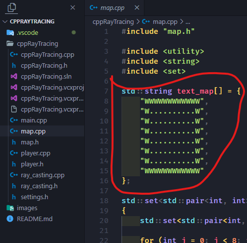

<h1 align="center"><b>Ray Tracing on C++</b></h1>
<h3 align="center">SFML | VISUAL STUDIO</h3>


<h2 align="center">Installation</h2>
<h3 style="font-size: 20px">1. Install <a href="https://visualstudio.microsoft.com/ru/downloads/">Visual Studio</a></h3>
<h3 style="font-size: 20px">2. Install <a href="https://www.sfml-dev.org/download.php">SFML</a></h3>
<h3 style="font-size: 20px">3. Unpack <code>SFML.zip</code> to <code>C:\SFML</code> (directories <code>lib</code>, <code>bin</code>, and <code>include</code> in <code>C:\SFML</code>)</h3>
<h3 style="font-size: 20px">4. Clone git repository</h3>

```shell
$ git clone https://github.com/CsgoBotTG/CppRayTracing.git
```

<h3 style="font-size: 20px">5. Copy all <code>.dll</code> from <code>C:\SFML\bin</code> to <code>CppRayTracing/cppRayTracing</code></h3>

<h2 align="center">Usage</h2>

<h3 style="font-size: 20px">1. Go to <code>CppRayTracing/cppRayTracing</code></h3>
<h3 style="font-size: 20px">2. Open <code>cppRayTracing.sln</code> in <a>Visual Studio</a></h3>
<h3 style="font-size: 20px">3. Compile with Debug or Release in <a>Visual Studio</a></h3>


### Customization
<p>If you want to customaze your map go to <code>cppRayTracing\map.cpp</code> and change string map</p>

